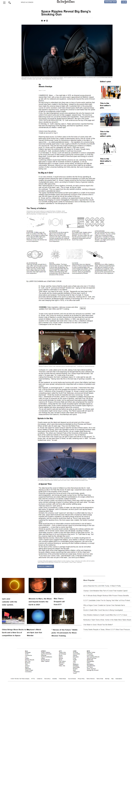

# HTML & CSS: New York Times - clone

This is an article that was posted on a New York Times Page on March 17th 2014.

<<<<<<< HEAD
![screenshot]
=======

>>>>>>> 78085035e789bcbc213b6e78b70dc0773135ba15

## Built With

- HTML
- CSS

## Live Demo

[NYT-Page-Clone](https://rawcdn.githack.com/garang96/NYT-Page-clone/ce5530acaab0d0863e2ce35f1cf8e4e488117e67/index.html)

## Authors

👤 **John alier Garang**

- Github: [@garang96](https://github.com/garang96)
